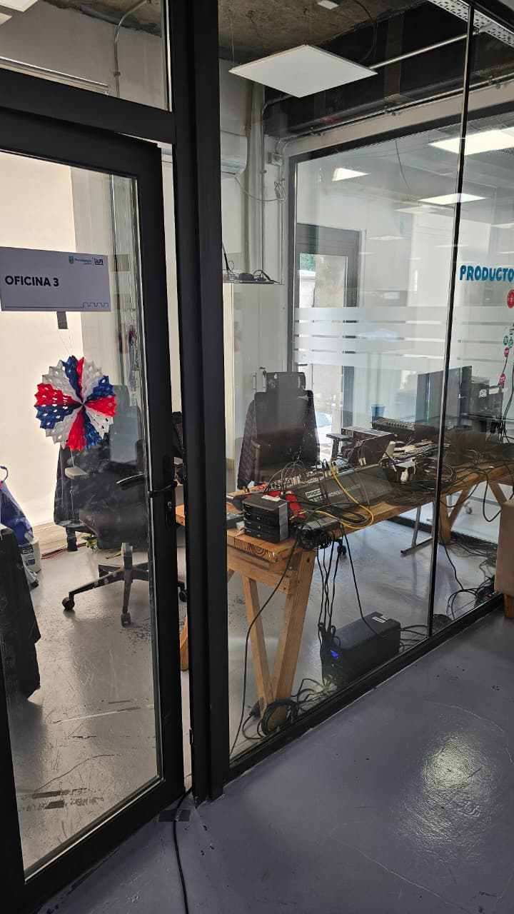
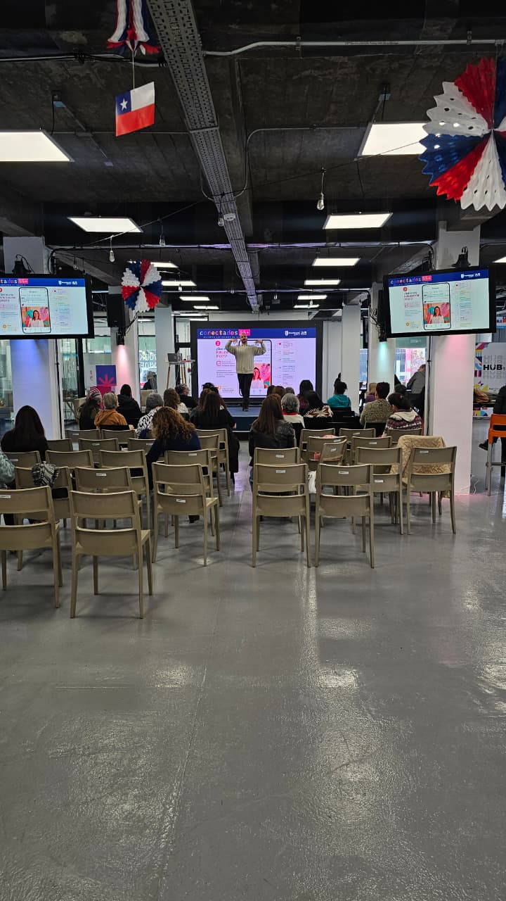
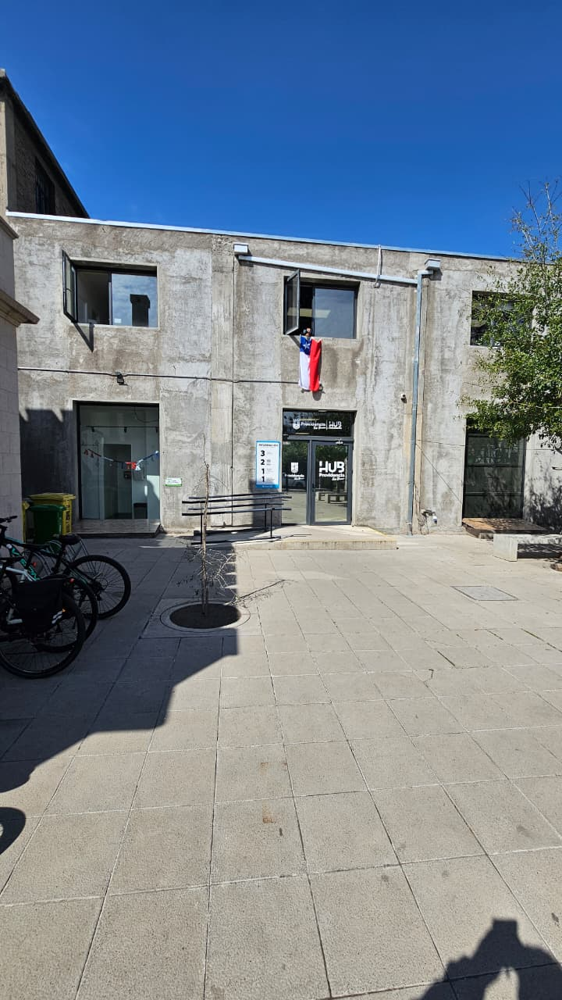
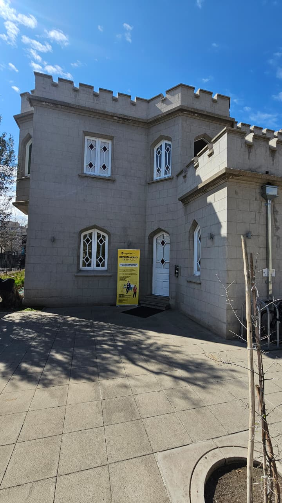
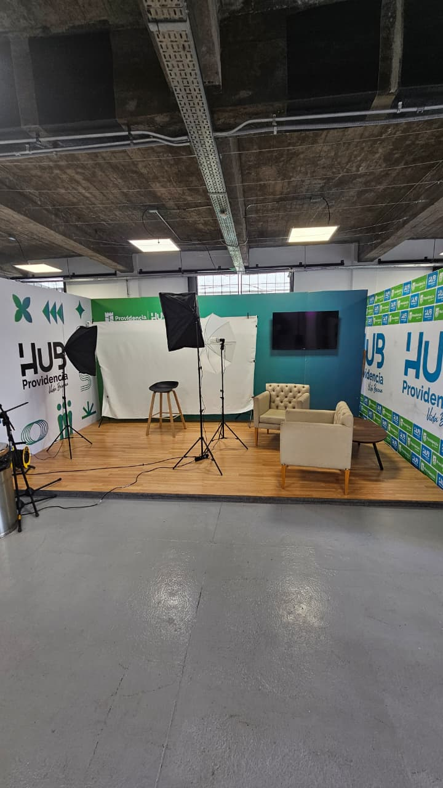
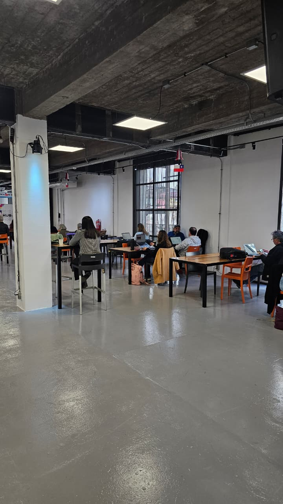
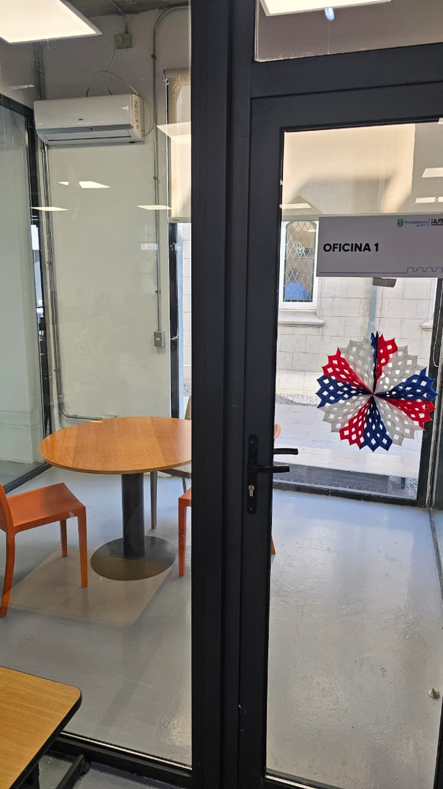

## 📌 Salida fuera de Sesión: Visita a Terreno en Hub Providencia (2 de Septiembre)

---

### 1. Cabina Técnica (Oficina 3)

*Oficina 3, sector con equipos de control y soporte técnico.*

---

### 2. Sala de Charlas y Talleres

*Espacio principal donde se realizan presentaciones y actividades con la comunidad.*

---

### 3. Fachada Principal

*Entrada y patio exterior del Hub Providencia.*

---

### 4. Departamento de Empleo

*Edificio anexo destinado a la atención de empleo.*

---

### 5. Set de Grabación

*Espacio equipado para podcasts, videos y entrevistas.*

---

### 6. Zona de Cowork

*Área abierta con mesas para trabajar y estudiar.*

---

### 7. Sala de Reuniones (Oficina 1)

*Oficina 1 para reuniones pequeñas o privadas.*
