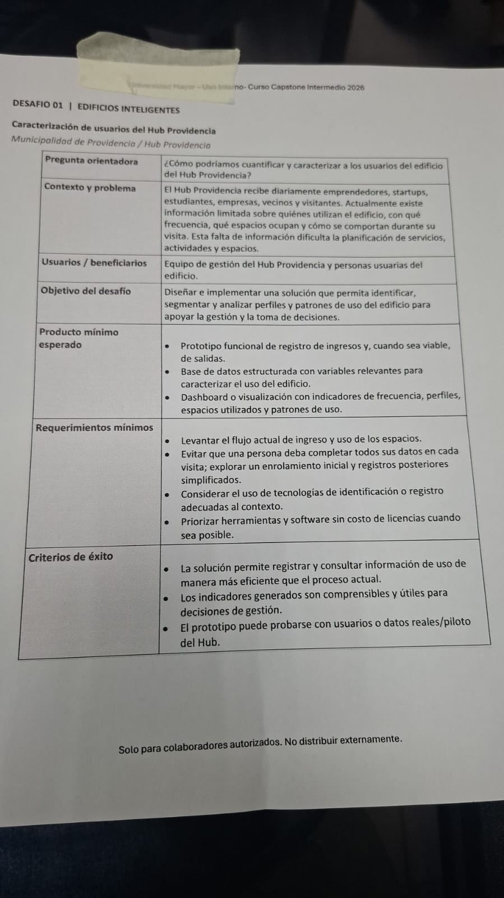
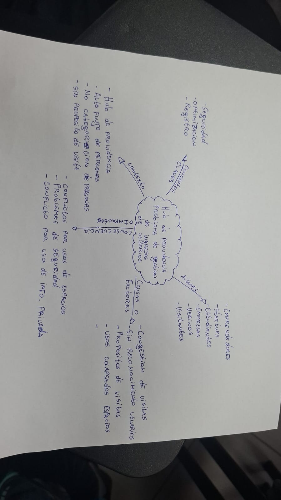

## 📌 Sesión 02: Selección de Proyecto y Mapa Conceptual (25 de Agosto)

---

### 1. Desafío Seleccionado: Edificios Inteligentes (Hub Providencia)

*Ficha oficial del Desafío 01 entregada por la cátedra, donde se detallan la pregunta orientadora, contexto, objetivo, producto mínimo esperado y criterios de éxito.*

---

### 2. Mapa Conceptual de la Problemática

*Análisis conceptual elaborado a mano por el equipo para identificar el problema central (gestión e ingreso de usuarios), actores involucrados, causas, contexto y consecuencias.*
