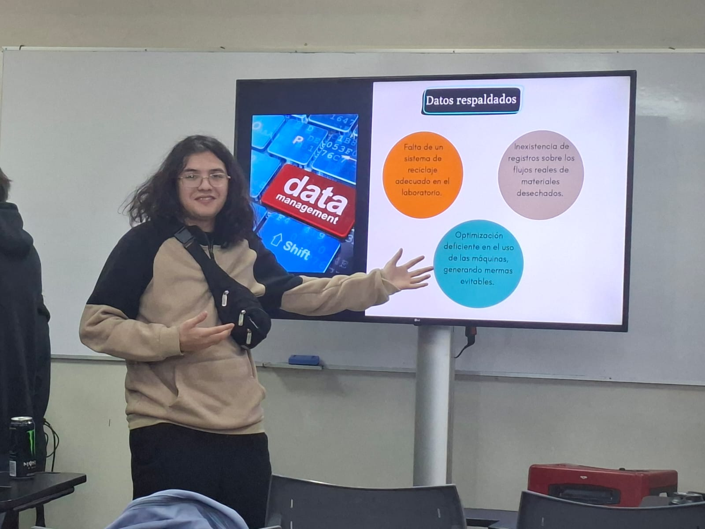

## 📌 Sesión 03: Presentación y Análisis de la Problemática (1 de Septiembre)

---

### 1. Exposición de la Problemática

*Presentación oficial frente al curso y al profesor, exponiendo el diagnóstico, los actores y las causas del problema de gestión en el Hub Providencia.*

---

### 2. Papelógrafo: Certezas, Incertidumbres y Preguntas Orientadoras

*Dinámica de mapeo para identificar lo que sabemos y no sabemos del problema, junto con las 4 preguntas orientadoras definidas por el equipo antes de la salida a terreno.*
