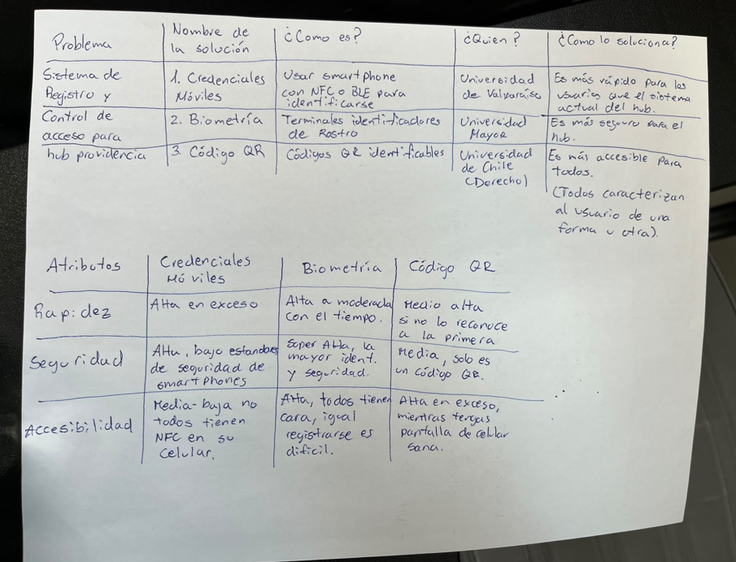
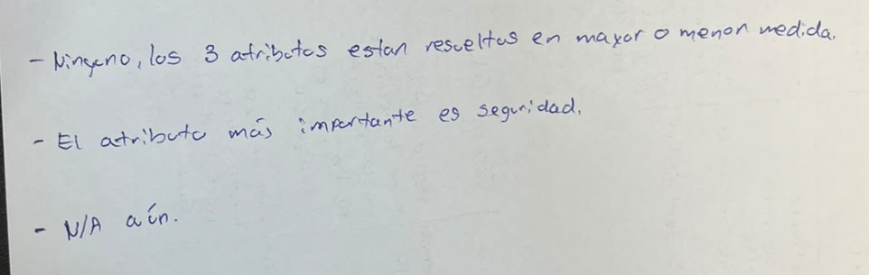
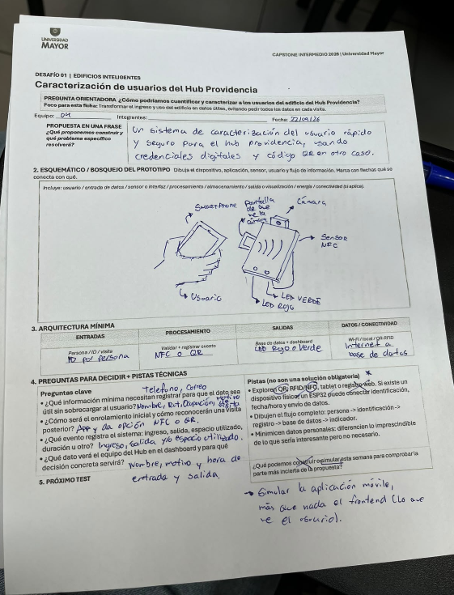

# 📸 Galería de Imágenes - Sesión 4 (22 de Septiembre)

En esta carpeta se documenta la evidencia visual del trabajo físico e ideación realizados por el equipo durante la Sesión 4.

## 1. Primer Boceto: Estado del Arte
Fotografía de la primera versión de la tabla del Estado del Arte, donde comenzamos a identificar las soluciones existentes.

## 2. Tabla de Benchmark
Fotografía de la tabla de Benchmark inicial para comparar los procesos y el desempeño de los sistemas analizados.

## 3. Matrices Detalladas (Estado del Arte y Atributos)
Fotografía del trabajo consolidado con las dos tablas completas y más detalladas: el cruce de las tres soluciones (Credenciales Móviles, Biometría, QR) con sus respectivos atributos de servicio (Rapidez, Seguridad, Accesibilidad).

## 4. Análisis Comparativo
Fotografía con las respuestas desarrolladas por el equipo a las tres preguntas analíticas basadas en el cruce de las matrices anteriores.

## 5. Ficha del Desafío 01 (Caracterización y Prototipo)
Fotografía de la ficha técnica completada, que incluye nuestra propuesta en una frase, el bosquejo físico del prototipo de hardware/software, la arquitectura mínima y los próximos pasos.

